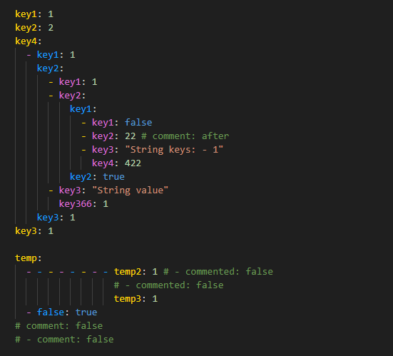
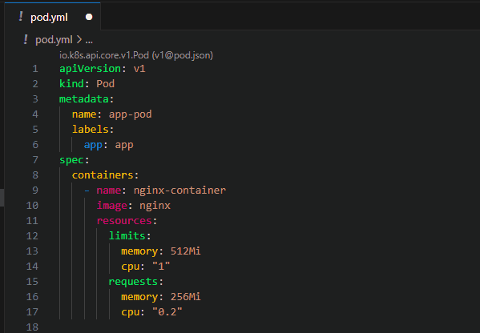
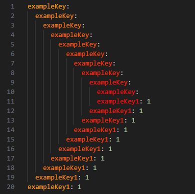

# yaml-colors

VSCode extension for coloring yaml keys based on intent

## Features

- Colors each key with cycled repeating colors from the chosen theme's brackets colors
- Option to provide our own colors, there's no limit of how many colors we can add
- Toggle the extension on/off through the Command Palette: `YAML Colors: Toggle Extension`

## Extension Settings

This extension contributes the following settings:

- `yamlColorsExt.enabled`: Enable/disable this extension.
- `yamlColorsExt.customColors`: Array of hex color strings, minimum 2 required, ex. `["#04E762", "#F5B700", "#00A1E4", "#DC0073"]`

**Enjoy!**
